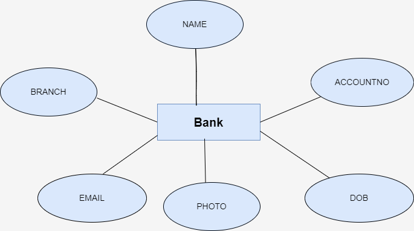

# Ex02 Django ORM Web Application
## Date: 04.11.24

## AIM
To develop a Django application to store and retrieve data from a bank loan database using Object Relational Mapping(ORM).

## ENTITY RELATIONSHIP DIAGRAM



## DESIGN STEPS

### STEP 1:
Clone the problem from GitHub

### STEP 2:
Create a new app in Django project

### STEP 3:
Enter the code for admin.py and models.py

### STEP 4:
Execute Django admin and create details for 10 books

## PROGRAM
```
admin.py

from django.contrib import admin
from.models import Bank,BankAdmin
admin.site.register(Bank,BankAdmin)

models.py

from django .db import models
from django.contrib import admin
class Bank(models.Model):
  name=models.CharField(max_length=50)
  accountno=models.IntegerField(primary_key="accountno")
  dob=models.DateField()
  aadharno=models.IntegerField()
  email=models.EmailField() 
  branch=models.CharField(max_length=21)
  photo=models.ImageField()

class BankAdmin(admin.ModelAdmin):
 list_display=('name','accountno','aadharno','dob','email','branch','photo')
	
class StudentAdmin(admin.ModelAdmin):
	list_display=('Name','Refno','percentage','DoB','Email')
```


## OUTPUT


## RESULT
Thus the program for creating a database using ORM hass been executed successfully
